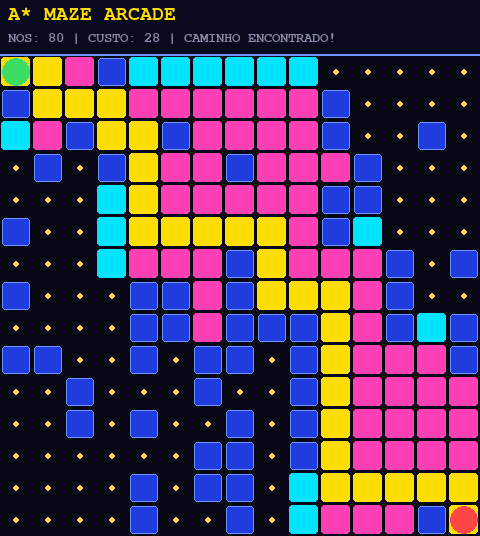
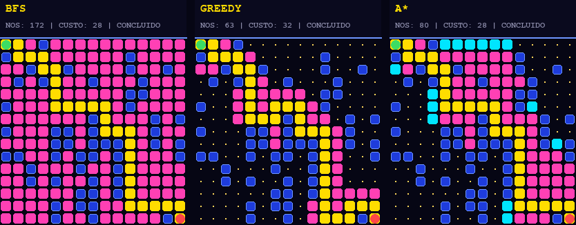
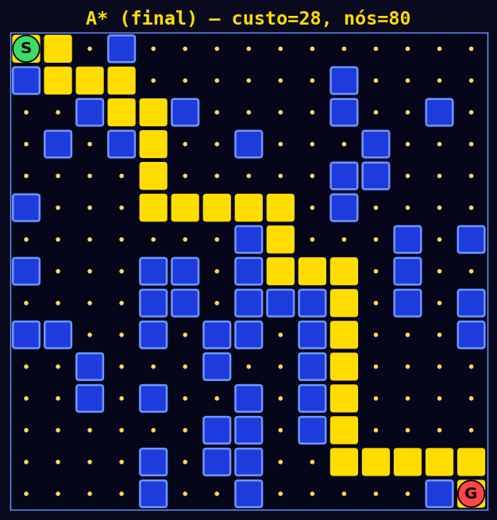
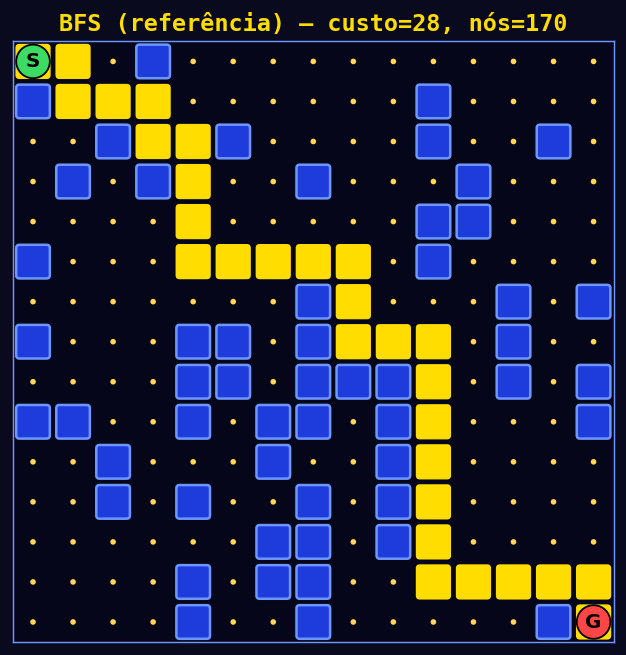
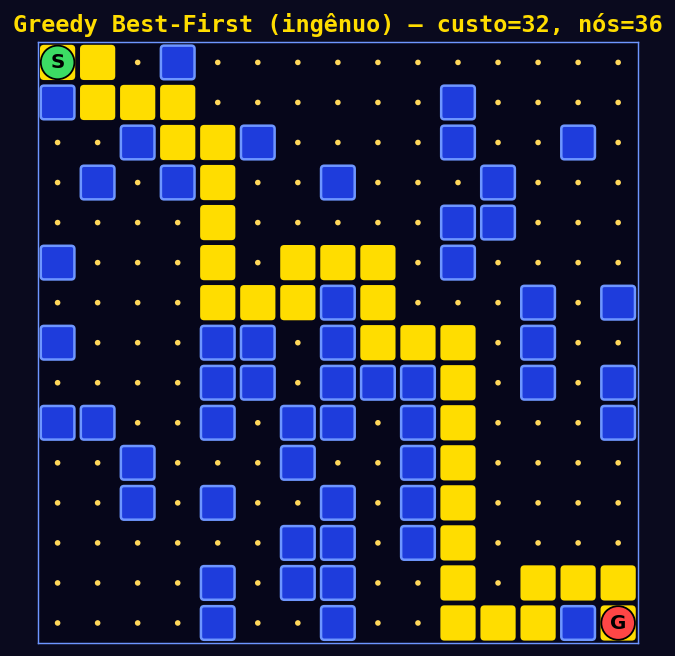
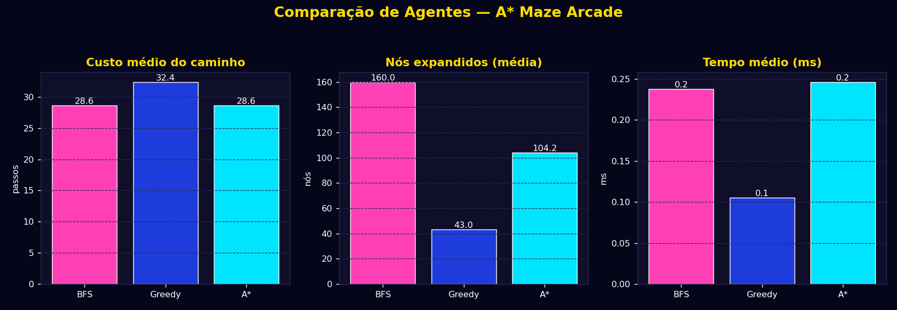

# 🕹️ Maze A\* Arcade — Agente de Busca Heurística em Labirinto

**Estudo Dirigido — IA 2026.1**
Integrante: **Yasmin da Silva Muniz** *(trabalho desenvolvido individualmente)*


Um agente **A\*** resolve um labirinto em grade, com visual estilo *arcade
dos anos 90* (paredes azuis, pac-dots, HUD de placar), comparado lado a
lado com **BFS** (referência) e **Greedy Best-First** (versão ingênua).

<p align="center">
  
</p>

---

## 📑 Sumário

1. [Contexto e objetivo](#1-contexto-e-objetivo)
2. [Ambiente](#2-ambiente-maze_envpy)
3. [Agentes](#3-agentes-agentspy)
4. [Como instalar](#4-como-instalar)
5. [Como executar](#5-como-executar)
6. [Protocolo de avaliação e métricas](#6-protocolo-de-avaliação-e-métricas)
7. [Limitações e possibilidades de melhoria](#7-limitações-e-possibilidades-de-melhoria)
8. [Uso de IA generativa](#8-uso-de-ia-generativa)
9. [Estrutura de arquivos](#9-estrutura-de-arquivos)

---

## 1. Contexto e objetivo

**Contexto I — Ambiente próprio.** Foi desenvolvido um ambiente de
labirinto em grade (grid NxN) no qual um agente deve encontrar o caminho
de menor custo entre a posição inicial e a posição objetivo, desviando
de obstáculos.

Foram implementados três agentes de busca no espaço de estados, para
permitir comparação teórica e empírica:

| Agente | Tipo | Papel no projeto |
|---|---|---|
| 🔵 **BFS** | busca não-informada | referência / baseline (custo mínimo garantido) |
| 🟡 **Greedy Best-First** | busca informada (só heurística) | versão "ingênua" inicial, mostra falhas/sub-otimalidade |
| 🔷 **A\*** | busca informada (custo + heurística) | agente final, robusto e ótimo |

<p align="center">
  
  <br><em>Os três agentes buscando simultaneamente no mesmo labirinto — cada painel roda em sua própria thread.</em>
</p>

---

## 2. Ambiente (`maze_env.py`)

- **Estado**: posição `(linha, coluna)` do agente na grade.
- **Ações**: `CIMA`, `BAIXO`, `ESQUERDA`, `DIREITA`.
- **Recompensa**: -1 por passo, -10 ao colidir com obstáculo/borda, +100 ao
  atingir o objetivo (o ambiente expõe uma interface `reset()`/`step()` no
  estilo Gym, deixando explícitos estado, ação e recompensa, mesmo a busca
  sendo feita sobre o modelo do ambiente).
- **Término**: chegada ao destino (sucesso) ou número de passos excede
  `max_steps` (timeout/falha).
- O labirinto é gerado aleatoriamente (com seed) e há verificação de que
  existe pelo menos um caminho válido entre início e fim.

## 3. Agentes (`agents.py`)

Formulação computacional comum:

- **Estado**: posição na grade.
- **Ações**: 4 movimentos ortogonais.
- **Objetivo**: estado == posição de destino.
- **Custo `g(n)`**: 1 por movimento.
- **Heurística `h(n)`**: distância de Manhattan até o destino (admissível
  para movimentos ortogonais de custo unitário, o que garante otimalidade
  do A*).
- `f(n) = g(n) + h(n)` no A*; `f(n) = h(n)` no Greedy; ordem FIFO no BFS.

---

## 4. Como instalar

```bash
git clone https://github.com/Yasmiinmuniz/agente-busca-heuristica-labirinto.git
cd agente-busca-heuristica-labirinto
python3 -m venv venv
source venv/bin/activate       # Windows: venv\Scripts\activate
pip install -r requirements.txt
```

---

## 5. Como executar

### ▶️ Avaliação completa (métricas + imagens + gráfico)

```bash
python run_experiment.py
```

Roda 10 labirintos, imprime uma tabela comparativa no terminal e salva:

| Arquivo | Conteúdo |
|---|---|
| `output_bfs.png` | labirinto + caminho encontrado pelo BFS |
| `output_greedy.png` | labirinto + caminho encontrado pelo Greedy |
| `output_astar.png` | labirinto + caminho encontrado pelo A* |
| `comparison_chart.png` | gráfico de barras: custo, nós expandidos e tempo |

<p align="center">
  
  
  
</p>

<p align="center">
  
</p>

### 🕹️ Visualização animada — A\* sozinho (estética retrô)

```bash
python pygame_visualize.py
```

Acompanhe a **busca do A\* passo a passo em tempo real**, com estética de
arcade anos 90 (labirinto estilo Pac-Man: paredes azuis, "pac-dots" nas
células livres, painel de placar no topo).

| Cor | Significado |
|---|---|
| ⬛ fundo escuro + pac-dot dourado | célula livre |
| 🔵 azul elétrico | parede |
| 🩵 ciano | Open List (fronteira) |
| 💗 magenta | Closed List (já explorados) |
| 🟡 amarelo | caminho final *(cor do próprio Pac-Man — evita conflito com o azul das paredes)* |
| 🟢 verde | início |
| 🔴 vermelho | objetivo |

O painel superior mostra ao vivo o algoritmo, os nós já expandidos e o
status da busca. O atraso entre cada expansão é configurável pela
constante `ANIMATION_DELAY_MS` no topo de `pygame_visualize.py`.

Essa visualização usa um *hook* opcional (`on_expand`) que `astar_search`
expõe apenas para fins de instrumentação/visualização — a lógica de busca,
a heurística de Manhattan e o resultado do algoritmo permanecem
exatamente os mesmos, com ou sem a animação (validado nos testes do
projeto).

### 🏁 Comparação ao vivo — os três algoritmos ao mesmo tempo

```bash
python pygame_compare.py
```

Abre uma janela com **três painéis lado a lado** — BFS, Greedy Best-First
e A* — todos buscando no mesmo labirinto simultaneamente, cada um em sua
própria thread. Cada painel mostra, em tempo real, a Open List, a Closed
List e o status (`BUSCANDO...` / `CONCLUÍDO`) daquele algoritmo. Como os
três têm eficiências diferentes, eles terminam em momentos diferentes —
essa é justamente a evidência visual de que o A* soluciona o problema
com muito menos exploração que o BFS, mantendo a mesma qualidade de
solução (ver seção 6).

> As threads apenas **leem** o ambiente (`env.neighbors`, `env.grid`) e
> nunca o modificam, e cada uma escreve só no seu próprio estado — por
> isso é seguro rodá-las concorrentemente. A thread principal (interface
> gráfica) apenas lê o estado mais recente de cada uma, a ~60 quadros por
> segundo, para desenhar os três painéis; ela nunca decide ou altera o
> rumo da busca.

### 🔍 Debug rápido em modo texto

```python
from maze_env import MazeEnv
from agents import astar_search

env = MazeEnv(size=10, obstacle_prob=0.25, seed=42)
result = astar_search(env)
print(env.render_ascii(path=result["path"]))
print("Custo:", result["cost"], "| Nós expandidos:", result["nodes_expanded"])
```

---

## 6. Protocolo de avaliação e métricas

- **N execuções**: 10 labirintos gerados com seeds diferentes (mesmo
  tamanho e densidade de obstáculos), para reduzir viés de instância única.
- **Métricas**: taxa de sucesso, custo médio do caminho, nós expandidos
  (eficiência da busca) e tempo médio de execução.
- **Comparação com referência**: BFS (busca não-informada) é usado como
  baseline de custo mínimo garantido. A* deve igualar o custo do BFS
  expandindo menos nós. Greedy expande ainda menos nós, mas pode gerar
  custo maior (sub-ótimo).

**Resultado típico** (10 labirintos 15×15, `obstacle_prob=0.28`):

| Agente | Sucesso | Custo médio | Nós expandidos (média) |
|---|---|---|---|
| BFS | 100% | 28,60 | 160,0 |
| Greedy | 100% | 32,40 | 43,0 |
| **A\*** | 100% | **28,60** | **104,2** |

> BFS e A* empatam no custo (ambos ótimos), mas A* expande ~35% menos nós
> que o BFS. Greedy expande bem menos nós, só que com custo ~13% maior
> (sub-ótimo).

---

## 7. Limitações e possibilidades de melhoria

- O ambiente assume observabilidade total (o agente "vê" o mapa inteiro
  para planejar); uma extensão natural seria observação parcial (sensor de
  vizinhança) com replanejamento.
- A geração aleatória de obstáculos não garante controle fino de
  dificuldade; poderia ser substituída por geração via DFS/backtracking
  para labirintos "perfeitos" (um único caminho).
- Não há tratamento de custo de movimento diferenciado (ex.: diagonais,
  terrenos com custo variável).

---

## 8. Uso de IA generativa

O Claude (Anthropic) foi utilizado para: (1) comparar os contextos do
roteiro do estudo dirigido e ajudar a estruturar o plano inicial; (2) gerar
a implementação inicial do ambiente, dos agentes de busca e do script de
comparação de métricas, a partir da especificação definida por mim.
Todo o código foi executado, testado e revisado por mim antes da
entrega — a formulação de estado/ação/heurística/recompensa e a escolha dos
três agentes comparativos foram decisões minhas, validadas com base na
teoria estudada em sala.

---

## 9. Estrutura de arquivos

```
maze_env.py            # ambiente (grid, estado, ações, recompensa, término)
agents.py              # BFS, Greedy Best-First e A* (todos com hook opcional on_expand)
visualize.py           # renderização estática do labirinto e do caminho em PNG
pygame_visualize.py    # animação em tempo real da busca do A* (estética retrô)
pygame_compare.py      # BFS, Greedy e A* rodando lado a lado, ao mesmo tempo
charts.py              # gráficos comparativos entre agentes (mesma estética)
run_experiment.py      # protocolo de avaliação, métricas, imagens e gráfico
requirements.txt
README.md
```
